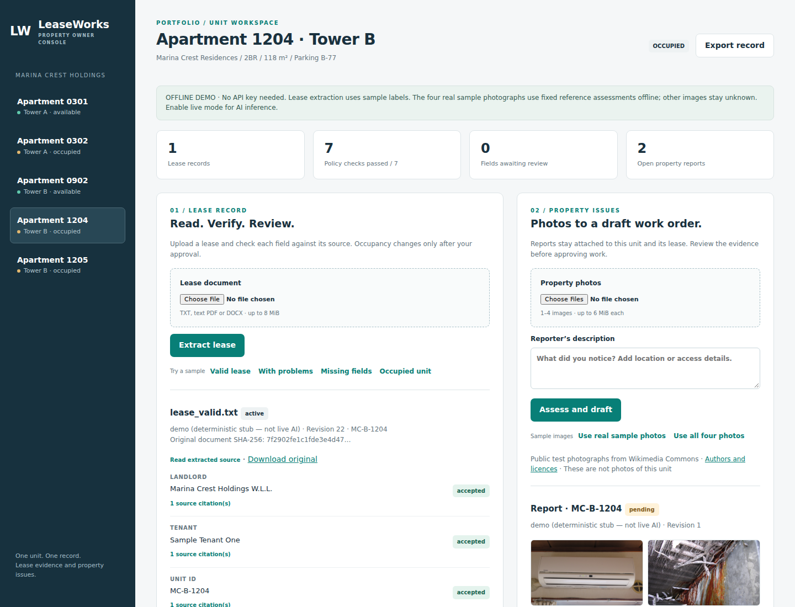
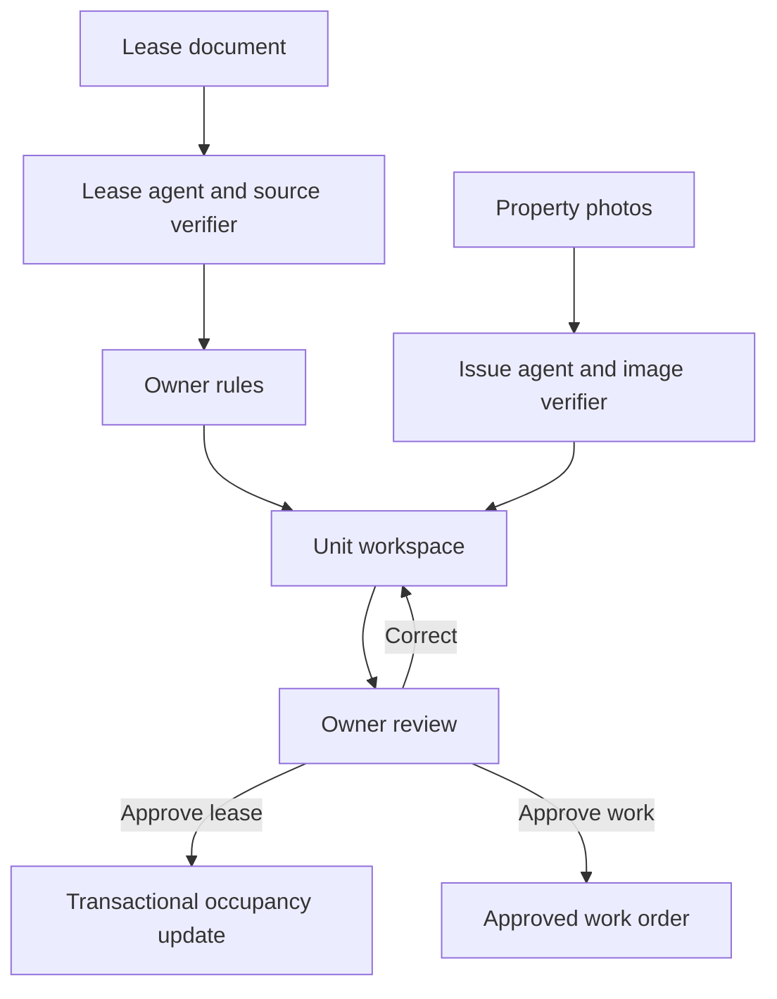

# LeaseWorks

I built LeaseWorks for the TrueLinks.AI SDE–Platform & Products exercise. It turns lease documents and property photographs into source-linked records an owner can inspect, correct and approve.

**The key product decision:** put the evidence, the owner's rules and the approval in the same unit workspace. A plausible AI answer should never quietly become a financial or occupancy decision.



## Run in five minutes

Use Python 3.12. No API key is needed for the default offline demo.

```bash
git clone https://github.com/Hannaancode/LeaseWorks.git
cd LeaseWorks
python -m venv .venv
source .venv/bin/activate
python -m pip install -r requirements.txt
python -m uvicorn app.main:app --host 127.0.0.1 --port 8000
```

For Windows PowerShell, open the project folder and run:

```powershell
py -3.12 -m venv .venv
.\.venv\Scripts\python.exe -m pip install -r requirements.txt
.\.venv\Scripts\python.exe -m uvicorn app.main:app --host 127.0.0.1 --port 8000
```

Open **http://127.0.0.1:8000**. SQLite and uploads are stored in `var/`; restarting keeps the records. The supplied rules and unit files are unchanged.

Alternatively, with Docker installed:

```bash
docker compose up --build
```

The container runs as a non-root user and binds the published port to localhost. Stop it with `docker compose down`. Docker is supplied as a run option; it was not executed in the development environment.

## Suggested walkthrough

1. Open Apartment 1204 and select **Valid lease**. Check the 18 extracted fields and seven passing rules. Uploading does not change occupancy.
2. Open **source citations** beside the rent or dates. Each quote has a source location, segment ID and character range. Download the original to inspect signatures.
3. Select **Use real sample photos**. The report shows the equipment, condition, limitations and work-order draft beside the lease.
4. Use **Correct assessment** to change a photo interpretation. The original is retained and the work order returns to pending review. Edit or accept/reject the work order with a reason.
5. Accept each lease field and review both signature flags. Select **Approve lease and mark unit occupied**. Availability is checked again inside the transaction.
6. Inspect the audit history and export the unit record. Then try **With problems**, **Missing fields** or **Occupied unit** to see failures and unknowns. A previously activated 1204 also fails availability for a new lease.

To repeat with a fresh database, stop the server and rename `var/` to a backup name before restarting. Preserve that folder if its records matter.

I use four real, attributed public equipment photographs for the sample image flow. They depict separate equipment, not the supplied units. Offline mode shows fixed reference assessments for their exact file hashes; live mode sends their actual bytes to the vision model. The sample leases contain fictional identities. Public lease-template evaluation is documented separately, so I do not present invented contracts as executed tenant agreements.

## Demo and live AI

| Mode | Lease behavior | Photo behavior |
|---|---|---|
| `demo` — default | Recognizes labelled sample clauses and detects conflicting values | Fixed reference assessments for the exact hashes of the four real sample photographs; all other images are unknown |
| `openai` | Interprets document text using strict structured output | Sends actual uploaded image bytes to a vision-capable model and requests image-cited observations |

The offline adapter is a stub, not an LLM. The interface says so. It never identifies equipment from a filename. This uses the brief's explicit permission to stub text and vision without an API key.

To enable live inference in Bash:

```bash
export MODEL_PROVIDER=openai
export OPENAI_API_KEY='your-key'
export OPENAI_MODEL='gpt-4.1-mini'
python -m uvicorn app.main:app --host 127.0.0.1 --port 8000
```

Use a model your account can access that supports images and strict JSON-schema output through the Responses API. `.env.example` documents the variables; the direct Python command does **not** automatically load `.env`. Docker Compose reads its environment configuration.

The live adapter requires outbound HTTPS to `api.openai.com` and sends lease text and uploaded photos to that provider. `store=false` is set, but it is not a promise of zero retention; check your account's applicable data policy before using real tenant data. No key is committed or returned by the API. Requests have a 60-second timeout. There is no silent fallback to demo mode if a live call fails.

**Live validation:** I exercised real Responses API calls with prose leases, public PDF forms, a fictional completion of an interactive tenancy form, bilingual Qatar scenarios and four attributed equipment photographs. Original integration results and earlier failures are recorded in [docs/LIVE_VALIDATION.md](docs/LIVE_VALIDATION.md); the public-form evaluation and fixes are in [docs/REALISTIC_VALIDATION.md](docs/REALISTIC_VALIDATION.md). This small integration set is not a held-out accuracy benchmark. [docs/EVALUATION.md](docs/EVALUATION.md) describes the broader evaluation needed before a pilot.

Both modes offer **Use real sample photos** (AC and coil) and **Use all four photos** (also heater and faucet); live mode additionally offers **Prose lease**. The photos depict separate equipment; they are illustrative samples, not inspections of the supplied units. Their authors and licences are listed in [samples/live/ATTRIBUTION.md](samples/live/ATTRIBUTION.md).

## How the agents work

The application runs two bounded agent workflows rather than allowing a model unrestricted write access.

The lease agent reads source segments, asks the model for evidence-linked fields, runs a source/type verifier, and gives verification feedback back to the model for **at most one repair attempt**. It then runs deterministic policy tools, matches an exact unit ID and suspends for review. An unresolved invalid citation is flagged and cannot be accepted without a recorded human correction. A failed structured response creates no lease record. A source gate returns ambiguous numeric dates to unknown instead of accepting a guessed locale. Equivalent rent-frequency wording is normalized to the canonical vocabulary while retaining the original proposal. A conservative English source check also blocks choosing between different stated monthly rents and includes both citations. The verifier preserves an explicitly cited fixed term instead of a model-computed duration. An exact quote assigned to the wrong segment is relocated only if it occurs in precisely one source segment, retaining both proposed and resolved locations in the audit data. Different explicit monetary currencies make amount comparisons unknown until corrected; no exchange conversion is attempted. It can require review for legitimate stepped schedules; resolving precedence and broader language coverage remain future work.

The issue agent inspects one to four images, verifies the returned image references and condition labels, proposes equipment observations and a work order, then suspends for the owner. The model never chooses a different unit: the report's unit comes from the selected register entry. Reporter claims are explicitly separate from visual observations. Uniform blank photos skip inference and request clearer evidence; their equipment and condition remain unknown. The workflow displays model version, request latency and token usage without exposing credentials.

The model interprets language and images. Application code owns policy evaluation, unit linkage, revision checks and database writes. This is deliberate: autonomy is useful for preparing work, while approvals remain explicit for decisions that affect tenants, money and contractors.



## Rules and verification

All seven supplied rules return `PASS`, `FAIL` or `NOT_DETERMINABLE` with a reason and available source clauses. The JSON `check` strings are never executed as code.

| Rule | Implementation |
|---|---|
| R1 | Compare deposit and stated monthly rent using Decimal |
| R2 | Require a cited escalation clause and a proposed defined-mechanism classification; explicitly reject the sample's vague mutual-agreement wording |
| R3 | Compare the stated term with 36 months |
| R4 | Check date order and the stated term's anniversary using calendar months |
| R5 | Require named parties and both reported signature markers |
| R6 | Compare stated annual rent with stated monthly rent × 12; never invent the missing annual value |
| R7 | Match an exact register ID and check availability before linking; recheck current availability at approval |

For R4, this prototype accepts either the last inclusive day or the exclusive anniversary date. For example, 1 October 2026 to 30 September 2027 or 1 October 2027 can both describe 12 months. Partial-month interpretation and legal drafting conventions need owner confirmation before production.

Quote membership proves that a cited passage exists. It does **not** prove that the model interpreted it correctly. R2's semantic classification and R5's signature presence need human inspection. A documentary `[signed]` marker does not authenticate a signature. Physical age, hidden faults, repair cost and safety cannot be established from a photo alone.

An owner can accept/reject every lease field, every flag and every work order, and correct lease values and photo observations. Changes retain originals and require reasons. Rejecting a flag records disagreement; it does not bypass a failed rule. Policy waivers, including approval for a term over 36 months, are intentionally not implemented.

Approval requires every field to have an accepted non-null valid value, every flag to have been reviewed and every rule to pass. This conservative prototype gate also requires the renewal and termination fields. Occupancy changes only after explicit lease approval. Approved leases are immutable; amendments need a future workflow.

## Structure and key decisions

| Area | Choice and trade-off |
|---|---|
| Backend | FastAPI, typed model boundaries, small separate modules for providers, agents, documents, rules and persistence |
| Frontend | Plain JavaScript, HTML and CSS; one responsive screen without a frontend build step |
| Database | SQLite WAL with unit/lease/issue tables and an append-only application audit log; easy to run, limited write concurrency |
| Evidence | Original upload hashes, exact source quotes and page/paragraph/line locations; image observations retain their image IDs |
| Human changes | Optimistic revisions prevent lost edits; original values and before/after changes are retained |
| Occupancy | One transaction updates the unit, lease and audit; a unique active-lease index and availability recheck prevent double allocation |
| Availability | Preserve pre-link status for historical R7 checks, then independently check live status at approval |
| AI cost | No background inference, bounded repair and no automatic HTTP retries; easier to understand cost and failures |

Uploads are bounded and image contents are decoded before assessment. Supported leases are UTF-8 TXT, text-based PDF and DOCX. PDF citations use whitespace-normalized page text; populated interactive PDF form fields retain page-and-field locations. DOCX tables retain table/row locations. A scanned PDF with no extractable text returns an OCR-required error. Upload HTML/script text is escaped in the UI. Browser cross-origin writes are blocked. These are prototype safeguards, not a production security certification.

The audit labels actions but there is no authenticated reviewer identity yet. **Run on localhost with sample data.** Authentication, authorization and organisation isolation are prerequisites for external use.

## Tests

**Final evaluation: 54/54 live-provider scenarios and 160 automated tests passed.** The case-by-case purpose, expected outcome, observed outcome and receipts are recorded in [test_cases.txt](test_cases.txt). The scenarios include original flows, public PDF formats, bilingual fictional leases, money/date/unit boundaries, DOCX and real photographs. These are scenario executions, not 54 independent real contracts or a held-out accuracy benchmark.

```bash
python -m pip install -r requirements-dev.txt
python -m ruff check app tests
python -m pytest -q
python -m playwright install chromium
python tests/browser_smoke.py
python tests/browser_adversarial.py
```

To download the public PDF test forms and create the clearly labelled fictional completion without any model calls:

```bash
python tests/realistic_validation.py --prepare-only
```

They are saved under `test-results/public-leases/`. The fictional narrative files are in `samples/realistic/`.

Opt-in paid validation, after privately setting `OPENAI_API_KEY`:

```bash
LIVE_RESULTS_DIR=test-results/live python tests/live_validation.py
python tests/realistic_validation.py
python tests/expanded_live_validation.py
BROWSER_MODEL_PROVIDER=openai SCREENSHOT_DIR=test-results/live python tests/browser_smoke.py
python tests/browser_adversarial.py
```

The live scenario runner limits calls and fixture size; it does not enforce an account-wide dollar cap. The default browser test remains offline even if a key is set.

The browser test starts its own fresh local server and isolated storage. `CHROMIUM_EXECUTABLE` can point to an existing compatible Chromium. It saves screenshots under ignored `test-results/` unless `SCREENSHOT_DIR` is set.

The test suite covers rule failures, missing values, fabricated citations and bounded repair, contradictory rents, invalid overrides, occupied units, concurrent approval, revisions, preservation of originals, multiple images, work-order decisions, condition corrections, invalid uploads, prompt-injection boundaries and provider errors. The browser test covers the complete owner flow and mobile overflow. GitHub Actions repeats lint, API tests and the browser walkthrough. See [docs/VALIDATION.md](docs/VALIDATION.md) for the actual run results and [docs/EXTENDED_VALIDATION.md](docs/EXTENDED_VALIDATION.md) for the earlier 150-test pass, failure fixes and browser recovery checks. [docs/MANUAL_TESTING.md](docs/MANUAL_TESTING.md) provides Windows startup commands and an expected-results checklist.

## What I left out and what breaks first

This is one ownership entity with local sample-data access. I left out login/roles, tenant identity, OCR and visual PDF signature inspection, a translated Arabic interface and complete RTL workflows, unit alias resolution, notifications, vendor dispatch, scheduling, accounting, legal interpretation, move-out and renewal workflows. Work-order approval records a decision; it does not contact a contractor.

At scale, synchronous model calls and parsing consume server threads, and SQLite becomes the first write bottleneck. The local files are also unsuitable for multiple app instances. I would introduce a job queue with explicit job states, idempotent ingestion, PostgreSQL transactions and tenant-scoped object storage before adding more agents. File and database writes are not a distributed transaction: a database failure can leave an orphan upload, so object cleanup is also needed.

Rules are versioned on each lease, but there is no rule-editor UI. Exact unit IDs avoid accidental fuzzy matches; a real lease that only says “1204” needs a suggested match and owner confirmation. Uploads are not deduplicated; repeated submissions create separate drafts. Future-dated leases currently update occupancy on approval rather than through a scheduling system.

## How I would make the product more useful

I would improve the owner's daily workflow before expanding agent autonomy. These are proposed enhancements, not claims about missing features in TrueLinks' existing product.

| Priority | Product improvement | Value and how I would measure it |
|---|---|---|
| First | Evidence-focused exception inbox; show rent/date/signature risks first and group safe fields for review | Less repetitive reviewing; measure time to decision and field-correction rate |
| First | Better intake: camera guidance, room/fixture labels, access details and request for a clearer image when needed | Fewer vague work orders; measure reports needing follow-up and usable-photo rate |
| First | Role-based access, verified reviewer identity and organisation isolation | Owners can safely delegate; test cross-role and cross-organisation access before pilot |
| Next | Arabic/English and RTL intake, including bilingual source evidence | Match tenant and inspector workflows in Qatar; test completion rates with both language groups |
| Next | Condition history and move-in/move-out comparisons for the same asset | Help distinguish new changes from earlier issues; record before/after evidence rather than inferring liability |
| Next | Lease dates, renewal reminders and scheduled occupancy; owner-approved rule exceptions | Reduce missed renewals and handle real contract variation; measure missed deadlines and exception turnaround |
| Next | Work-order lifecycle: assignment, access appointment, budget approval, completion photos and owner sign-off | Close the loop; measure report-to-approval and approval-to-closure separately |
| Later | Connect approved work to existing vendor, procurement and asset records | Avoid re-entry; measure duplicate requests and manual handoffs |
| Continuous | Use owner corrections as a reviewed evaluation dataset with model/prompt version tracking | Detect regressions; track evidence validity, critical-field accuracy and false reassurance |

I would establish a baseline with real users before assigning improvement percentages. AI confidence alone would not be an approval signal. Good failure behavior means asking for a missing clause or clearer photo and showing why.

My proposed first 30 days and an existing project example are in [docs/FIRST_30_DAYS.md](docs/FIRST_30_DAYS.md). A concise submission email is in [docs/SUBMISSION_NOTE.md](docs/SUBMISSION_NOTE.md).

## Existing public work

[RecoverML — my existing public repository](https://github.com/Hannaancode/RecoverML) is a reproducible ML artifact recovery prototype with versioned dependencies, hash checks, correctness tests, benchmark logs and plots. It provides a separate codebase for reviewing how I structure and explain engineering work.

## AI assistance and references

I used AI coding assistance for this exercise, as the brief permits. The design boundaries, test cases, failure behavior and product choices are documented so the implementation can be inspected and reproduced.

Provider implementation references: [Responses API](https://developers.openai.com/api/reference/responses/overview), [structured outputs](https://developers.openai.com/api/docs/guides/structured-outputs?api-mode=responses) and [image inputs](https://developers.openai.com/api/docs/guides/images-vision). Product planning is informed by the exercise and [TrueLinks' official product overview](https://truelinks.ai/en), reviewed on 5 October 2026. I have not seen the company's internal architecture or roadmap.

The supplied JSON fixtures remain attributed to the exercise. Code remains the author's; no licence granting product reuse has been added.
